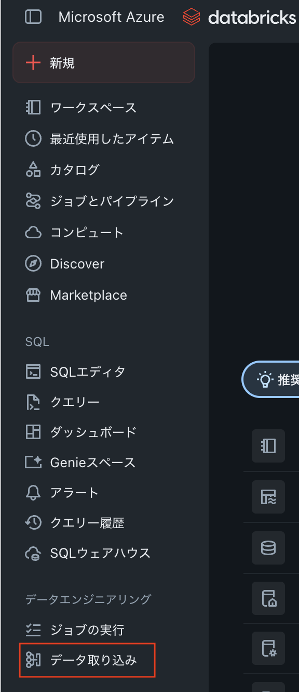
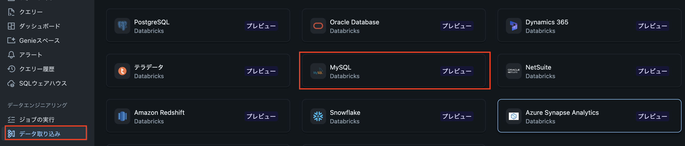
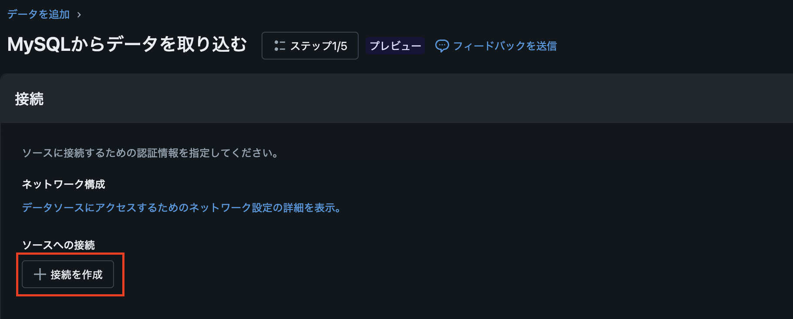
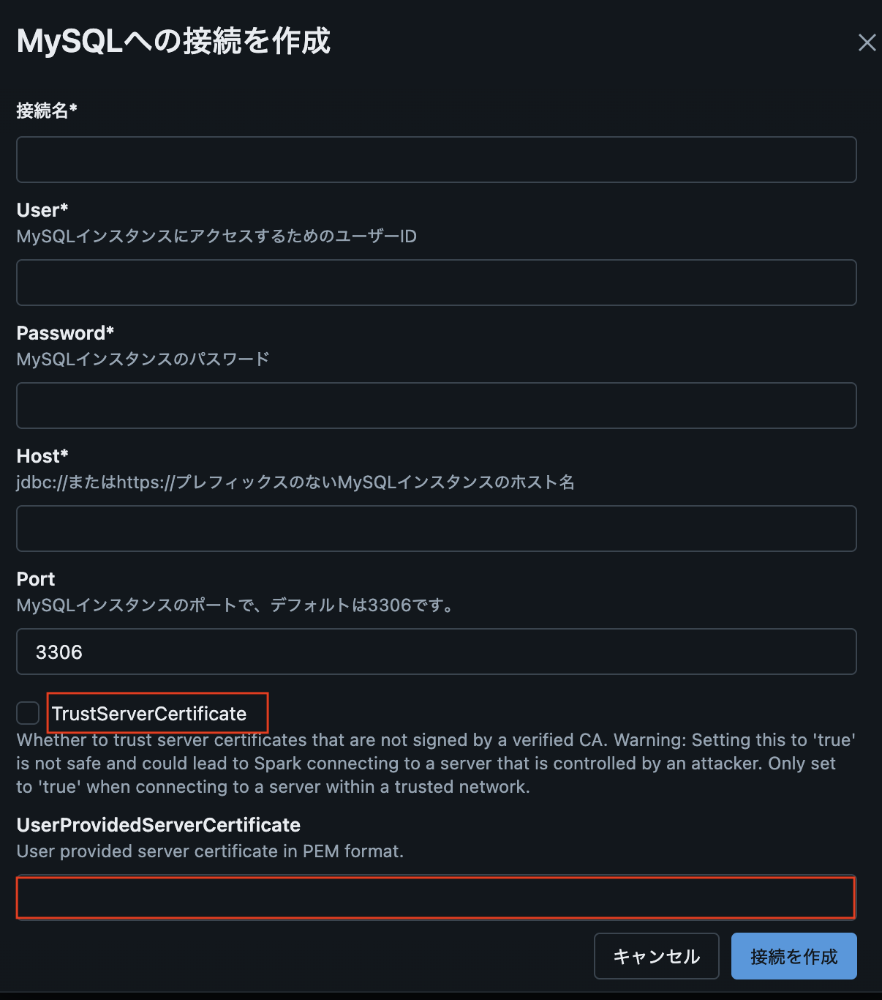
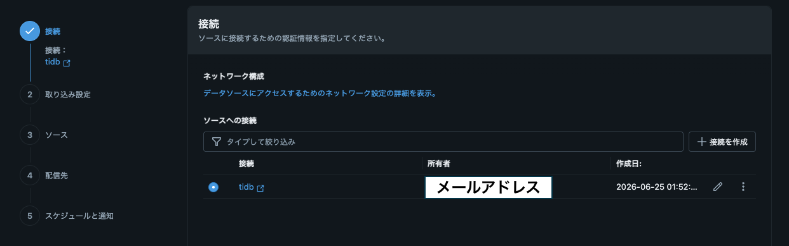
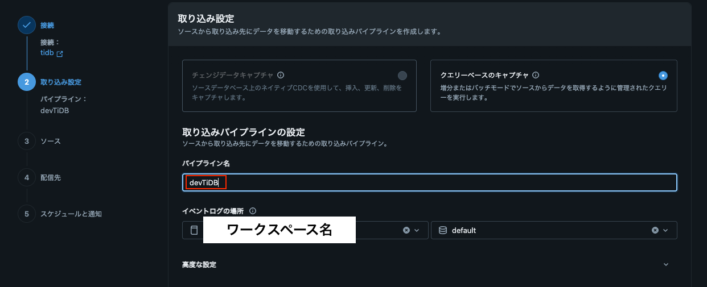
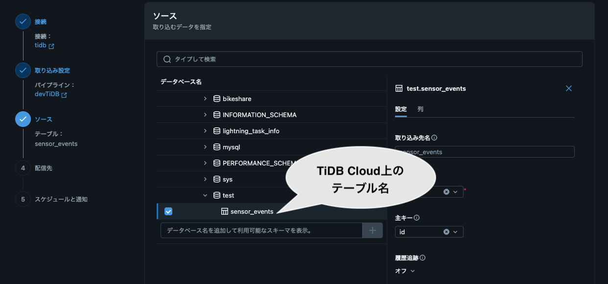
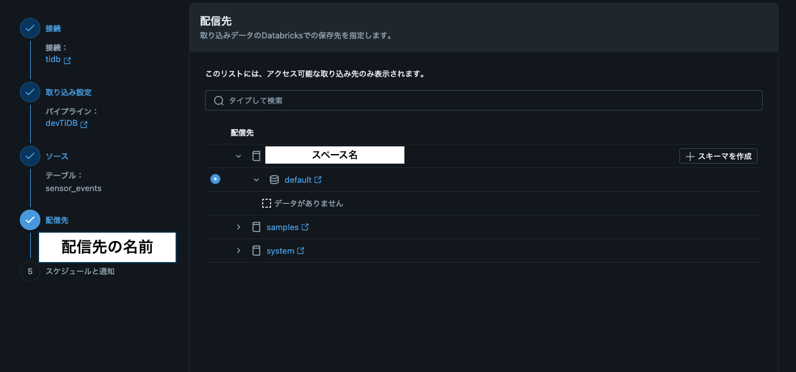
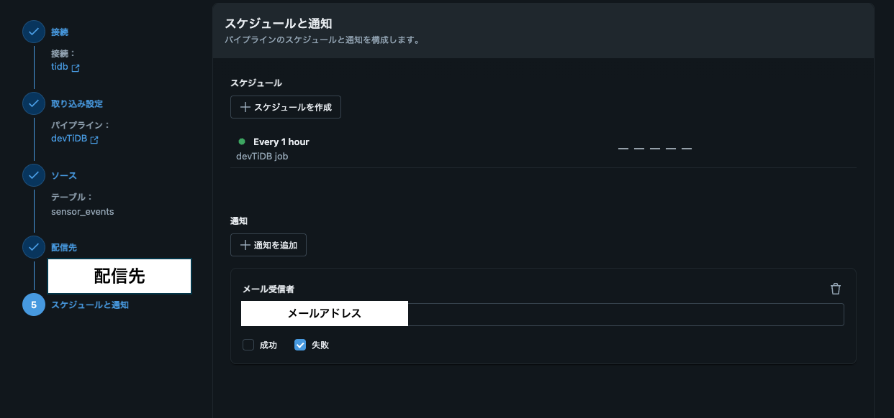
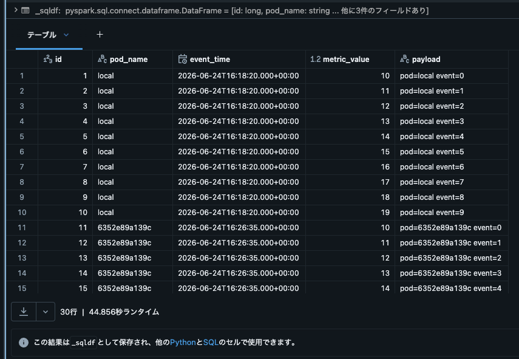

# TiDB Databricks エージェント実行ガイド

## PoCの概要

```text
Kubernetesの複数PodからTiDBに対してデータを投入してTiDBのスケーリングを検証しつつ、Databricksを使ってTiDBを可視化します。挿入されたデータが正しく可視化されることを確認することで、TiDBのスケーリングが正しく行われていることを検証したいです。
また、挿入したデータをAIが読めるようにすることで、AIがTiDBのデータを活用できることを検証します。
構築手順はおおまかに以下の通りです。

1.TiDB Cloudにデータベースを作成
  pytidbで対応する
2.KubernetesのPodからTiDB Cloudに対してデータを投入
  pytidbでTiDB Cloudにデータを挿入
3.TiDB CloudとDatabricksを接続する
  コンソール上で設定するのでAIによる対応は不要
4.DatabricksでTiDB Cloudのデータを可視化
  コンソール上で設定するのでAIによる対応は不要だが、サンプルコードは必要
5.DatabricksのカタログにTiDBを登録する
  コンソール上で設定するのでAIによる対応は不要だが、サンプルコードは必要
6.カタログに登録したデータをAIに読ませる
  サンプルコードが必要

開発環境は以下の通りです。

ローカル環境
ツール: Rancher Desktop
言語: Python 3.11(uvを利用)
インフラ: Kubernetes

クラウド
Azure Databricks, TiDB Cloud

注意点

- 秘匿情報は `.env` に記載し、それ以外には記載しないこと
```

## ローカル環境の作業

- uvは `.venv` に仮想環境を作成してください
- サンプルコードはデータを挿入するだけの簡単なものでOKです。データベースの作成/データを挿入するだけのコードを作成してください。データベースの作成は pytidb でお願いします。最初の実行は uv の仮想環境で行ってください。
- 作成したスクリプトは Dockerfile で実行できるようにしてください。docker 上では uv ではなく python3 で実行できるようにしてください。
- 作成した Dockerfile を使って、Kubernetes の Pod を作成できるようにマニフェストを作成してください。マニフェストは yaml 形式で作成してください。
  - Pod の中でスクリプトを実行して TiDB Cloud にデータを挿入する手順を README に記載してください

## 1. ローカル実行手順

### 1.1 依存関係の準備

まずは uv を使って仮想環境を作成し、依存関係をインストールしてください。

```bash
uv venv .venv
source .venv/bin/activate
uv pip install -e .
```

これで、準備が整いました。

### 1.2 環境変数の設定

次に、`.env_sample` をコピーして `.env` を作成してください。`.env`を作成する方法は以下の通りです。

```bash
cp .env_sample .env
```

`.env` で次の変数を設定してください。この変数を使ってTiDB Cloud に接続します。

```text
TIDB_HOST=your-tidb-host
TIDB_PORT=4000
TIDB_USER=root
TIDB_PASSWORD=your-tidb-password
TIDB_DATABASE=sample
BATCH_SIZE=10
```

### 1.3 実行

スクリプトを実行して、TiDB Cloud にデータを挿入します。データは `sensor_events` テーブルに挿入されます。テーブルが存在しない場合は、スクリプトが自動的に作成します。

```bash
uv run python src/tidb_loader.py
```

実行結果

```text
Inserted 10 rows into TiDB from local
```

TiDB Cloud上で確認する場合はSQL Editorを使って以下のSQLを実行してください。

```sql
USE test;
SELECT
  `id`,
  `pod_name`,
  `event_time`,
  `metric_value`,
  `payload`
FROM
  `sensor_events`
```

## 2. Docker での実行

ローカル実行できたら、次に Docker で実行します。Dockerfile を使って Docker イメージを作成し、コンテナを起動してデータを挿入します。今回はRancher Desktopを使っていますので起動を忘れないようにしてください。

まずは、Dockerfile を使って Docker イメージを作成します。

```bash
docker build -t tidb-loader:latest .
```

次に、作成した Docker イメージを使ってコンテナを起動し、データを挿入します。`.env` ファイルを使って環境変数を設定してください。

```bash
docker run --rm --env-file .env tidb-loader:latest
```

実行結果

```text
Inserted 10 rows into TiDB from 6352e89a139c
```

実行したコンテナのIDは `6352e89a139c` です。このIDがpod_nameとして、TiDB Cloudに挿入されたデータの `pod_name` カラムに記録されます。TiDB Cloud上で確認する場合はSQL Editorを使って以下のSQLを実行してください。

```sql
USE test;
SELECT
  `id`,
  `pod_name`,
  `event_time`,
  `metric_value`,
  `payload`
FROM
  `sensor_events`
WHERE
  `pod_name` = '6352e89a139c'
/*
pod_nameがコンテナIDとなっているデータが挿入されていることを確認してください
*/
```

## 3. Kubernetes での実行

### 3.1 事前に Docker イメージを用意する

2. Docker での実行で作成した `tidb-loader:latest` イメージを Kubernetes から参照できる状態にしてください。Rancher Desktop で Docker が利用できる環境なら、そのまま使えます。必要に応じてローカルレジストリやイメージプル設定を整えてください。

### 3.2 Secret を作成

まずは、Kubernetes の Secret を作成して、TiDB Cloud の接続情報を安全に管理します。`.env` ファイルの内容を使って Secret を作成します。

```bash
set -a
source .env
set +a
```

次に、以下のコマンドを実行して Secret を作成します。

```bash
kubectl create secret generic tidb-credentials \
  --from-literal=TIDB_HOST="$TIDB_HOST" \
  --from-literal=TIDB_USER="$TIDB_USER" \
  --from-literal=TIDB_DATABASE="$TIDB_DATABASE" \
  --from-literal=TIDB_PASSWORD="$TIDB_PASSWORD"
```

これでKubernetes の Secret `tidb-credentials` が作成されました。Pod からこの Secret を参照して、TiDB Cloud に接続できます。

※`k8s/tidb-secret.yaml` は雛形です。実際の値はリポジトリへコミットせず、上の `kubectl create secret` コマンドや Kubernetes の Secret 管理機能で安全に設定してください。

※`POD_NAME` は Pod の名前を自動で渡すための環境変数です。スクリプトではこの値を使って、どの Pod からデータを挿入したかを識別できます。

### 3.3 Pod を作成

Kubernetes の Pod を作成して、TiDB Cloud にデータを挿入します。`k8s/tidb-loader-pod.yaml` を使って Pod を作成してください。

```bash
kubectl apply -f k8s/tidb-loader-pod.yaml
```

実行結果を確認するには、以下のコマンドを実行してください。

```bash
kubectl logs pod/tidb-loader-pod
```

実行結果

```text
Inserted 10 rows into TiDB from tidb-loader-pod
```

TiDB Cloud上で確認する場合はSQL Editorを使って以下のSQLを実行してください。

```sql
USE test;
SELECT
  `id`,
  `pod_name`,
  `event_time`,
  `metric_value`,
  `payload`
FROM
  `sensor_events`
WHERE
  `pod_name` = 'tidb-loader-pod'
/*
pod_nameがPod名となっているデータが挿入されていることを確認してください
*/
```

## 4. Databricks を準備する

今回は、Azure Databricks を使って TiDB Cloud のデータを可視化します。Azure Databricksは、Azure Portal から作成できます。以下のリンクから Azure Portal にアクセスして、Databricks ワークスペースを作成してください。

- [Azure Portal](https://portal.azure.com/#home)

ワークスペースを作成したら、次に進みます。

## 5. Databricks で TiDB Cloud に接続する

TiDBはMySQL互換のデータベースですので、Databricks では MySQL 用の JDBC ドライバを使用して接続できます。
これから実際に Databricks で TiDB Cloud に接続する手順を説明します。

おおまかな手順は以下の通りです。

1.`データ取り込み`から`MySQL`を選択
2.`MySQLからデータを取り込む`で、TiDB Cloud の接続情報を入力
3.接続の作成
  - 接続名
  - User
  - Password
  - Host
  - Port
  - TrustServerCertificate
    - チェックを入れる
  - UserProvidedServerCertificate

### 5.1. TiDB CloudとDatabricksの接続

まずはデータの取り込みを行います。サイドメニューから`データ取り込み`をクリックします。



TiDBはMySQL互換のデータベースなので、コネクターの一覧から`MySQL`を選択します。



`接続を作成`をクリックします。接続の作成では、TiDB Cloud の接続情報を入力します。接続名、ユーザー名、パスワード、ホスト名、ポート番号を入力する必要があります。これまでの手順では`.env ファイル`に接続情報を記載しているので、そこからコピーして入力してください。



.envファイル記述していない項目として、`TrustServerCertificate`にチェックを入れ、`UserProvidedServerCertificate`を入力する必要があります。`UserProvidedServerCertificate`は、TiDB Cloud の証明書を入力してください。今回の接続名は`tidb`としました。



接続作成されたら、取り込み設定に移動します。



パイプラインの設定を行います。パイプライン名は`devTiDB`です。パイプラインの設定が完了したら、`次へ`をクリックします。



ここではTiDB Cloud のデータベース名、テーブル名を指定します。今回は、データベース名は`default`、テーブル名は`sensor_events`を指定します。



配信先の設定を行います。今回は、Databricks のデフォルトのカタログに配信するように設定します。



スケジュールと通知を設定します。今回はスケジュール設定をしないため、そのまま`次へ`をクリックします。



これでTiDB CloudとDatabricksの接続が完了しました。TiDB　Cloud のデータを Databricksのカタログとして確認できます。

### 5.2. Databricksのノートブックを作成

次にDatabricksのノートブックを作成してカタログとして登録されたTiDB Cloudのデータを確認します。
今回はデータを確認するために次のクエリをノートブックで実行します。

```sql
%sql
SELECT * FROM `<スペース名>`.`default`.`sensor_events`;
```

なお、Serverlessで実行するため、初回の実行は少しだけ時間がかかります。

実行結果



### 5.3. Databricksのノートブックを活用

ここからは、Databricks のノートブックを使って、TiDB Cloud のデータをPythonで処理する方法を説明します。Databricks のノートブックでは、SQL クエリを実行してデータを取得し、Python で分析や可視化を行うことができます。

今回はSparkを使ってデータを表示します。実行するコードは以下の通りです。

```python
df = spark.read.table("<ワークスペース名>.default.sensor_events")
display(df)
```

Databricksではノートブックで2行のコードを実行するだけで、TiDB Cloud のデータを表示できます。

## 6.mem9を使う

```bash
gh repo clone mem9-ai/mem9 & cd mem9
```

```bash
MNEMO_DSN="user:password@tcp(host:4000)/test?parseTime=true&tls=true" go run ./cmd/mnemo-server
```

## 5. 参考

- [pytidb - GitHub](https://github.com/pingcap/pytidb)
  - [https://docs.pingcap.com/ja/ai/connect/](https://docs.pingcap.com/ja/ai/connect/)
- [Analytics on TiDB Cloud with Databricks](https://www.pingcap.com/blog/analytics-on-tidb-cloud-with-databricks/)
